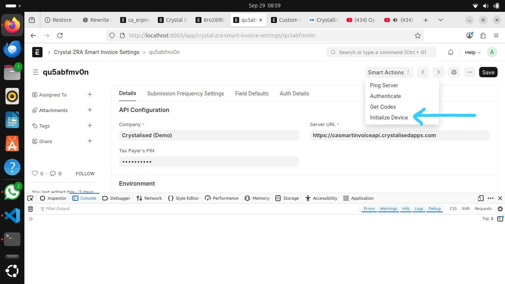

### Ca Erpnext Zra

# Zambia Revenue Authority (ZRA) VSDC API Integration for Frappe/ERPNext

A Frappe custom application that integrates with the Zambia Revenue Authority (ZRA) Virtual Sales Data Controller (VSDC) API to enable seamless tax compliance, e-invoicing, and reporting directly within your ERP system.

This app provides a secure and standardized way for businesses to interact with ZRA’s VSDC platform, ensuring all electronic invoices, receipts, and related tax data are automatically transmitted in compliance with ZRA regulations.

##  Features
-  **Device Initialization** with ZRA Smart Invoice system  
-  Retrieval of **Standard Codes** (classification, VAT, excise, packaging, etc.)  
-  **Item Registration**: save ERPNext items with ZRA Smart API  
-  **Background Jobs** for async API calls  
-  **Integration Request Logs** for request/response traceability  
-  Automatic item status updates (`custom_item_registered`) on success  


### Installation

You can install this app using the [bench](https://github.com/frappe/bench) CLI:

```bash
cd $PATH_TO_YOUR_BENCH
bench get-app $URL_OF_THIS_REPO --branch develop
bench install-app ca_erpnext_zra
# Apply patches and custom fields
bench migrate
```
##  Configuration

Then configure the app inside **ERPNext**:

1. Go to **Crystal ZRA Smart Invoice Settings** in ERPNext  
2. Enter your **TPIN**, **Branch ID (BhfId)**, and **API credentials**  
3. Save and mark settings as **Active**  

---

##  Workflow

### 1️1. Device Initialization  

The first step is to initialize your device with the **Smart Zambia system**.  
This ensures your ERPNext installation is linked with **ZRA’s secure VSDC servers**.

- **Endpoint**: `InitializeDevice`  
- **ERPNext DocType**: `Crystal ZRA Smart Invoice Settings`  

 

---

### 2. Retrieval of Standard Codes  

To correctly classify items, ZRA requires standard codes such as:  

- **Item Classification Codes** (`itemClsCd`)  
- **Item Type Codes** (`itemTyCd`)  
- **Packaging Unit Codes**  
- **Quantity Unit Codes**  
- **VAT / IPL / Levy / Excise Categories**  

These codes are retrieved from the **Smart API** and stored in **custom ERPNext doctypes** for reuse.  

 

---

### 3. Item Classification Codes  

ERPNext **Items** are linked to **Crystallised Smart doctypes**, where each field references a standard code from ZRA.  

For example:  

- `custom_smart_item_classification_code` → `itemClsCd`  
- `custom_smart_item_type` → `itemTyCd`  
- `custom_smart_country_of_origin` → `orgnNatCd`  
- `custom_smart_packaging_unit_code` → `pkgUnitCd`  
- `custom_smart_quantity_unit_code` → `qtyUnitCd`  

 

---

### 4️⃣ Saving Items (Item Management)  

Once Items are properly configured, they can be **registered with Smart Zambia**.  

#### 🔹 Payload Builder  

We build a **ZRA-compliant payload** from ERPNext Item data.  

**Example Payload**:  

```json
{
  "tpin": "1234567890",
  "bhfId": "01",
  "itemCd": "ITEM-0001",
  "itemClsCd": "101",
  "itemTyCd": "1",
  "itemNm": "Sample Item",
  "itemStdNm": "Sample Standard Name",
  "orgnNatCd": "ZM",
  "pkgUnitCd": "PKG",
  "qtyUnitCd": "EA",
  "taxTyCd": "A",
  "btchNo": "BATCH001",
  "bcd": "8901234567890",
  "dftPrc": 100.0,
  "addInfo": "Test item for Smart Invoice registration"
}
```
---
 Once submitted, the system will:  

- Enqueue the request in **Frappe background jobs**  
- Send the payload to **Crystal VSDC API**  
- Log request/response in the **Integration Request doctype**  
- Mark the Item as **registered** upon success  
---

5. Background Jobs  

Item registration runs **asynchronously**:  

```python
enqueue(
    method=_process_item_registration,
    queue="long",
    job_name=f"Register Item {item.name} with Smart Zambia",
    timeout=300,
    item_name=item.name,
    settings_name=settings["name"],
)
```
- Jobs are visible under Background Jobs Desk

- Each request is tracked in Integration Requests

---
 **Developer Notes**

### Error Handling  
- Done via an `ErrorObserver`  
- Errors are logged instead of failing silently  

### Key Modules  
- `utils/payload_utils.py` → builds request payloads  
- `apis/api_processor.py` → orchestrates API requests  
- `apis/api_builder.py` → executes remote calls  
- `item_api.py` → item registration workflows  

### Custom Fields  
Use fixtures to export/import custom fields into your ERPNext instance:  

```bash
bench export-fixtures
```
---


**Roadmap**
- Invoice Save/Issue integration
- Automatic scheduled sync of codes, and Hooks overrides
- Unit tests for payload builders and API calls

---

##  Integrated Endpoints

| #  | Endpoint Name              | ERPNext DocType                        | Purpose                                         |
|----|-----------------------------|----------------------------------------|-------------------------------------------------|
| 1  | `/InitializationInfo/selectInitInfo`          | Crystal ZRA Smart Invoice Settings      | Links ERPNext device with Smart Zambia VSDC     |
| 2  | `/CodeData/selectCodes`          | Smart Standard Codes (custom doctypes) | Retrieves classification, unit, and tax codes   |
| 3  | `/ItemsClassInformation/selectItemsClass`     | Smart Item Classification Codes        | Fetches valid item classification codes (itemClsCd) |
| 4  | `/ItemInformation/saveItem` (Item Management)| Item                                   | Registers ERPNext items in Smart Zambia system  |

### Contributing

This app uses `pre-commit` for code formatting and linting. Please [install pre-commit](https://pre-commit.com/#installation) and enable it for this repository:

```bash
cd apps/ca_erpnext_zra
pre-commit install
```

Pre-commit is configured to use the following tools for checking and formatting your code:

- ruff
- eslint
- prettier
- pyupgrade

### License

agpl-3.0
