### CA ERPNext ZRA Smart Invoice

# Zambia Revenue Authority (ZRA) VSDC Smart Invoice API Integration for Frappe/ERPNext

A Frappe custom application that integrates with the Zambia Revenue Authority (ZRA) Virtual Sales Data Controller (VSDC) API to enable seamless tax compliance, e-invoicing, and reporting directly within your ERP system.

This app provides a secure and standardized way for businesses to interact with ZRA’s VSDC platform, ensuring all electronic invoices, receipts, and related tax data are automatically transmitted in compliance with ZRA regulations.

##  Features
- **Authentication**:The authentication module manages secure access to the **Crystal ZRA Smart Invoice API** using **JWT
-  **Device Initialization** with ZRA Smart Invoice system  
-  Retrieval of **Standard Codes** (classification, VAT, excise, packaging, etc.)  
-  **Item Registration**: save ERPNext items with ZRA Smart API  
- **Sales Management**: Manages the full Sales lifecycle
- **Purchase Management** Manage the full purchase lifecycle in compliance with Zambia regulations
- **Import Management** Integrate with ERPNext Purchase and Stock modules for imported items
- **Stock Adjustment**: Handles real-time stock synchronization with ZRA
-  **Background Jobs** for async API calls  
-  **Integration Request Logs** for request/response traceability  


### Installation

You can install this app using the [bench](https://github.com/frappe/bench) CLI:

```bash
cd $PATH_TO_YOUR_BENCH
bench get-app $URL_OF_THIS_REPO --branch develop
bench install-app ca_erpnext_zra
# Apply patches and custom fields
bench migrate
```
##  Configuration

Then configure the app inside **ERPNext**:

1. Go to **Crystal ZRA Smart Invoice Settings** in ERPNext  
2. Enter your **Company**, **Server URL**, **TPIN**, and **API credentials(Auth Details)**  
3. Save and mark settings as **Active**  

---

## Features & Workflow

### 1. Device Initialization  

Before interacting with ZRA’s Smart Invoice system, the ERPNext instance must be initialized as a registered VSDC device.
This process associates your business TPIN and Branch ID (BhfId) with ZRA’s infrastructure.

- **Endpoint**: `InitializeDevice`  
- **ERPNext DocType**: `Crystal ZRA Smart Invoice Settings`  

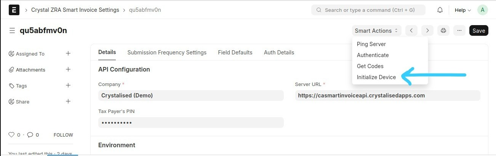
This need to be done only once from Crystal ZRA Smart Invoice Settings using the smart action Initialize Device 

---

### 2. Authentication

The authentication module manages secure access to the **Crystal ZRA Smart Invoice API** using **JWT (JSON Web Tokens)**.  
It ensures that all API requests to ZRA are authorized and compliant with security standards.

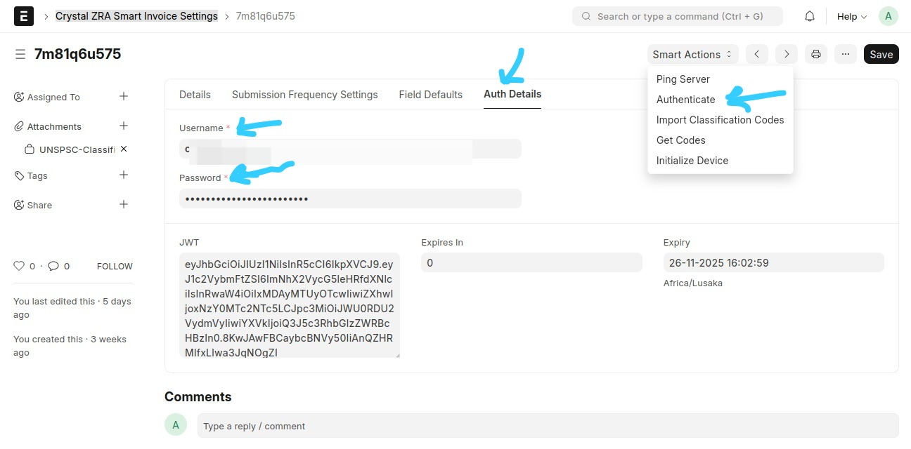

Note: An expired token or empty value triggers autamatic authentication when the user makes a request

####  Key Capabilities:
- Automated login using `/api/v1/Users/GetToken`
- Securely stores and refreshes the JWT before expiry
- Injects the `Authorization: Bearer <token>` header into every API request
- Caches tokens in the **Crystal ZRA Smart Invoice Settings** doctype
- Transparent error handling and token renewal

####  Technical Notes:
- Managed via `ZRAAuthService` in `services/auth_service.py`
- Automatically refreshes tokens using per-request validation
- Logs authentication attempts in the **Integration Request** table for traceability


####  Example Response:
```json
{
  "Version": "1.0",
  "StatusCode": 200,
  "IsSuccess": true,
  "Result": {
    "token": "eyJhbGciOiJIUzI1NiIsInR5..."
  }
}
```


### 3. Retrieval of Standard Codes  


To correctly classify items, ZRA requires standard codes such as:  
  
- **Item Type Codes** (`itemTyCd`)  
- **Packaging Unit Codes**  
- **Quantity Unit Codes**  
- **VAT / IPL / Levy / Excise Categories**  

These codes are retrieved from the **Smart API** and stored in **custom ERPNext doctypes** for reuse.  

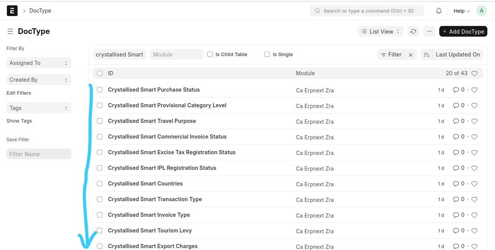

---

### 4. Item Classification Codes  

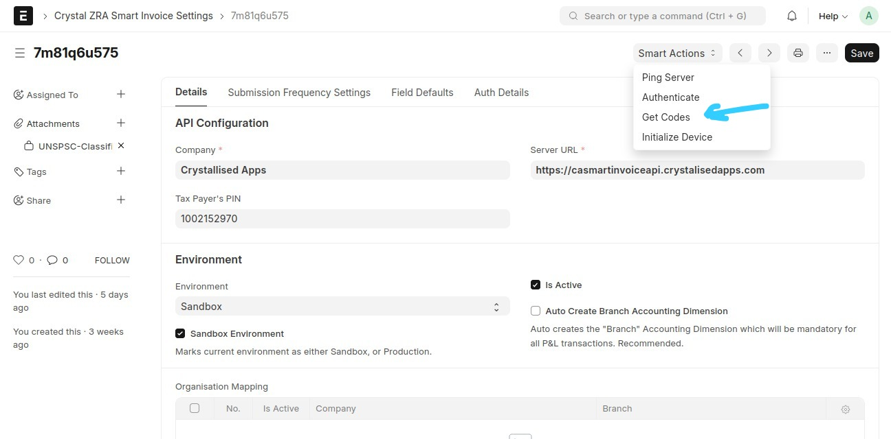

Note: At the moment the API responds with only 1000 codes. You need to import the rest using Data import tool

ERPNext **Items** are linked to **Crystallised Smart doctypes**, where each field references a standard code from ZRA.  

For example:  

- `custom_smart_item_classification_code` → `itemClsCd`  
- `custom_smart_item_type` → `itemTyCd`  
- `custom_smart_country_of_origin` → `orgnNatCd`  
- `custom_smart_packaging_unit_code` → `pkgUnitCd`  
- `custom_smart_quantity_unit_code` → `qtyUnitCd`  


---

### 4. Saving Items (Item Management)  
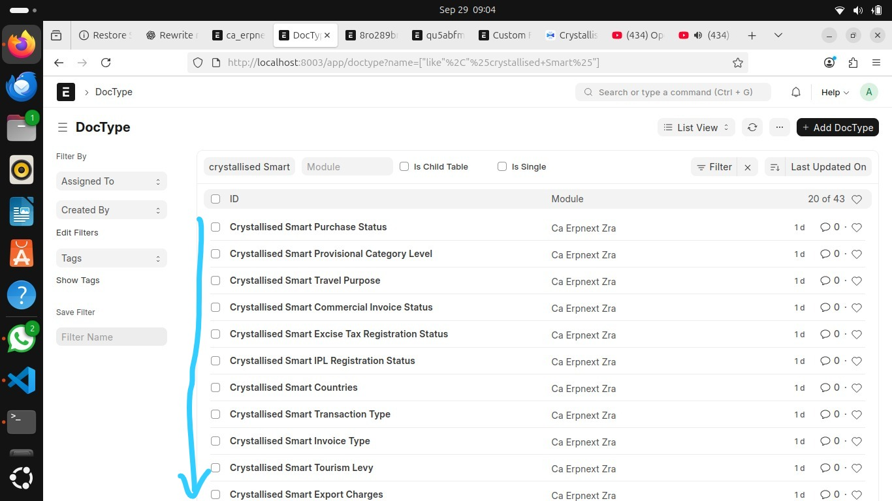
Once Items are properly configured, they can be **registered with Smart Zambia**.  

The following fields need to be filled for saving an item successfully:
- `Smart Item Classification Code`  
- `Smart Item Type`  
- `Smart VAT Category Code`
- `Smart Country Of Origin` 
- `Smart Packaging Unit`  
- `Smart Quantity Unit` 
The saving of an item happens automatically on saving or updating the item on our ERPNext. Incase this doesn't due to any reason, the smart action button Register(Item) does the same.

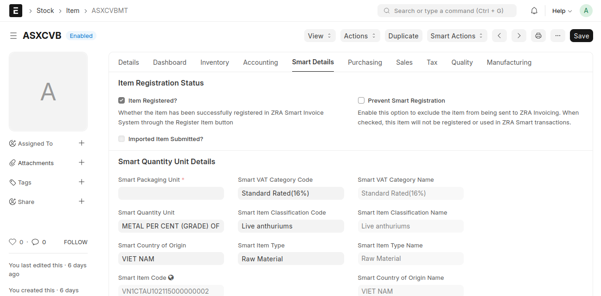
The item shown here has already been successfully registered.


#### 🔹 Payload Builder  

We build a **ZRA-compliant payload** from ERPNext Item data.  

**Example Payload**:  

```json
{
  "tpin": "1234567890",
  "bhfId": "01",
  "itemCd": "ITEM-0001",
  "itemClsCd": "101",
  "itemTyCd": "1",
  "itemNm": "Sample Item",
  "itemStdNm": "Sample Standard Name",
  "orgnNatCd": "ZM",
  "pkgUnitCd": "PKG",
  "qtyUnitCd": "EA",
  "taxTyCd": "A",
  "btchNo": "BATCH001",
  "bcd": "8901234567890",
  "dftPrc": 100.0,
  "addInfo": "Test item for Smart Invoice registration"
}
```
---
 Once submitted, the system will:  

- Enqueue the request in **Frappe background jobs**  
- Send the payload to **Crystal VSDC API**  
- Log request/response in the **Integration Request doctype**  
- Mark the Item as **registered** upon success  
---

### 5. Sales Management
Manages the complete Sales Record lifecycle — from saving a sale to issuing invoices through the ZRA Smart Invoice platform.

The system supports the seamless creation and submission of sales for items already registered and authorized with ZRA. When a Sales Invoice is submitted in ERPNext, all details are automatically transmitted to the Smart Invoice system for signing.

If the automatic submission fails for any reason, the “Send Invoice” smart action allows you to manually resend the invoice for signing.

In addition, the module supports generating and saving both Credit Notes and Debit Notes linked to an existing sale.
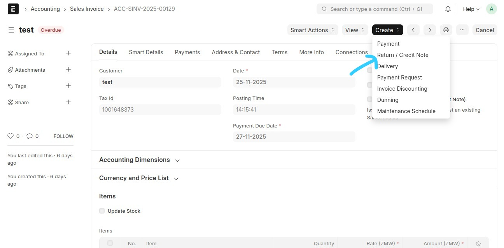
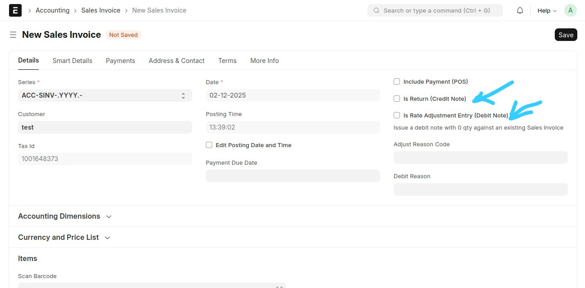

#### Key Capabilities:

-Automatically builds and sends Sales Invoice,Credit Notes and Debit Notes payloads

- Integrates with /SalesInformation/SaveSales for sales save

- Integrates with /SalesInformation/SaveCreditNote for Return sales save


---

### 6. Purchase Management

#### Purchase Processing Workflow
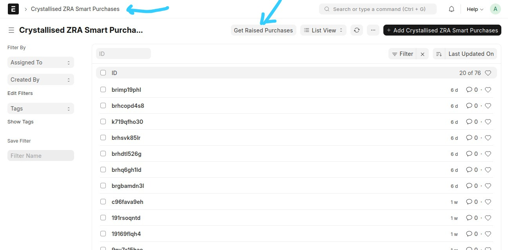
The purchase process begins with the user fetching registered purchases from the ZRA system.

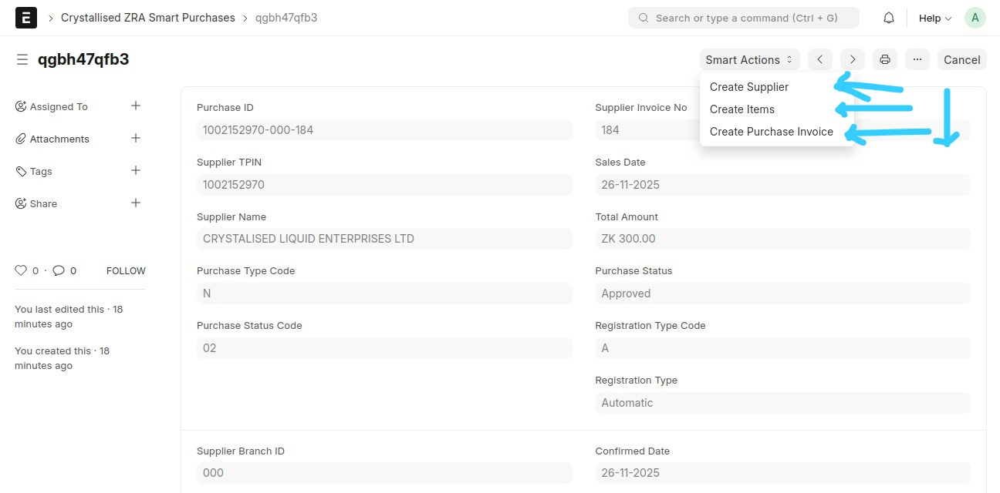
For each approved purchase, you can generate a Purchase Invoice after completing the required setup steps—this includes creating the supplier and creating/registering the item if it does not already exist.

The system also supports purchases from suppliers who are not registered with the authority.
In such cases, the user simply creates the supplier in the system and proceeds to create a standard Purchase Invoice without requiring ZRA registration.

### 7. Import Management
Import Processing Workflow
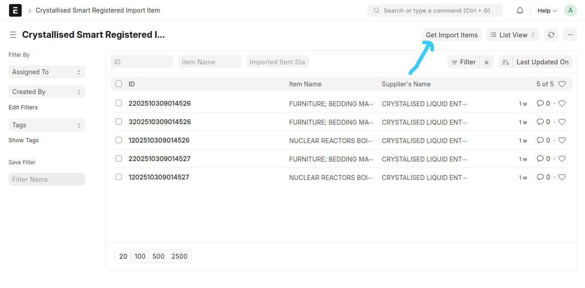

Similar to the purchase process, import handling begins with the user retrieving raised imports from ASYCUDA.
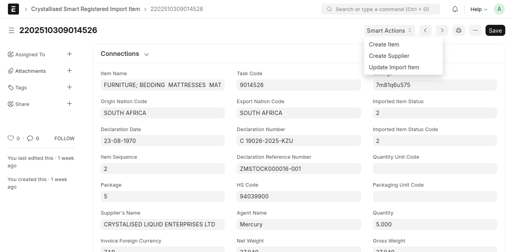
For each imported item that requires acknowledgement(Update Import Item), the user must first create and register the item, marking it as an Imported Item.
Once the item is registered, the user can proceed to generate a Purchase Invoice linked to that import entry 

### 8. Stock Adjustment
Stock Synchronization

The system handles real-time stock synchronization with ZRA, ensuring that all inventory movements remain consistent with the authority’s records.

Stock updates can originate from:

- Stock Entry

- Stock Reconciliation

- Purchase Transactions

- Sales Transactions

All stock movements are monitored through the Stock Ledger Entry, where the system checks the corresponding Voucher Type to determine the nature of the transaction.

When an item is created with an opening stock value, the system automatically generates a Material Receipt stock entry.

Additionally, all stock activity—including approved purchases, imports, sales, and other adjustment entries—is submitted periodically every 4 minutes, along with updated quantity balances, to maintain continuous synchronization with ZRA.
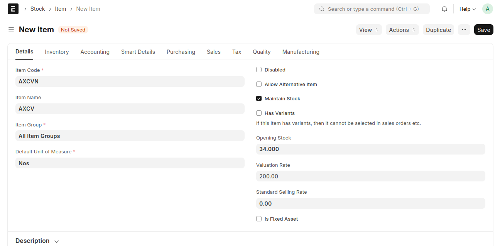


#### Key Capabilities:

Posts updated stock quantities to Smart Invoice system

Supports /StockItemInformation/saveStockItems


### Background Jobs & Integration Requests 

Item registration runs **asynchronously**:  

```python
enqueue(
    method=_process_item_registration,
    queue="long",
    job_name=f"Register Item {item.name} with Smart Zambia",
    timeout=300,
    item_name=item.name,
    settings_name=settings["name"],
)
```
- Jobs are visible under Background Jobs Desk

- Each request is tracked in Integration Requests

---
 **Developer Notes**

### Error Handling  
- Done via an `ErrorObserver`  
- Errors are logged instead of failing silently  

### Key Modules  
- `utils/payload_utils.py` → builds request payloads  
- `apis/api_processor.py` → orchestrates API requests  
- `apis/api_builder.py` → executes remote calls  
- `item_api.py` → item registration workflows  

### Custom Fields  
Use Frappe Export Customizations to export/import custom fields into your ERPNext instance:  

```bash
bench migrate
```
---


**Roadmap**
- Stock Master Information
- Automatic scheduled sync of codes, and Hooks overrides
- Unit tests for payload builders and API calls

---

##  Integrated Endpoints

| #  | Endpoint Name              | ERPNext DocType                        | Purpose                                         |
|----|-----------------------------|----------------------------------------|-------------------------------------------------|
| 1  | `/InitializationInfo/selectInitInfo`          | Crystal ZRA Smart Invoice Settings      | Links ERPNext device with Smart Zambia VSDC     |
| 2  | `/CodeData/selectCodes`          | Smart Standard Codes (custom doctypes) | Retrieves classification, unit, and tax codes   |
| 3  | `/ItemsClassInformation/selectItemsClass`     | Smart Item Classification Codes        | Fetches valid item classification codes (itemClsCd) |
| 4  | `/ItemInformation/saveItem` (Item Management)| Item                                   | Registers ERPNext items in Smart Zambia system  |
| 5 | `/ItemInformation/updateItem` | Item | Update specific product item details |
| 6 | `/ItemInformation/selectItem` | Item | Retrieves details of a product item based on the provided Item code |
| 7 | `/PurchaseInformation/selectTrnsPurchaseSales` (Purchase Management) | Retrieves all purchases made by a another business using smart invoice system |
| 8 | `/PurchaseInformation/savePurchase` | Utilized to approve or reject all purchases made by a business from suppliers  
| 9  | `/SalesInformation/SaveSales` (Sales Management)| Normal Sales Invoice                                   | Accepts invoice information, customized to a particular invoicing system and submits it to ZRA
  |
| 10  | `/SalesInformation/SaveCreditNote` (Sales Management)| Credit Note                                   | Accepts credit invoice information and submits it to ZRA  |
| 11  | `/SalesInformation/SelectInvoice` (Sales Management)| Sales Invoice                                   | Takes a SelectInvoice query and returns the invoice that exists in the ZRA environment  |
| 12 | `/SalesInformation/SaveDebitNote` | Sales | Accepts debit invoice information and submits it to ZRA
| 13  | `/StockItemInformation/SaveStockItems` (Stock Adjustment)| Stock Item Information                                   | Add stock items that have been recorded from approved sales to Smart Invoice.  |
| 14 | `/ImportItemsInfo/SelectImportItems` | Import Management  |Retrieves a list of imported items saved on Smart Invoice from ASYCUDA. |
| 15 | `/ImportItemsInfo/UpdateImportItem` |  Used to acknowledge, or disregard imported items received from Smart Invoice which were declared on ASYCUDA. |
| 16 | `/StockItemInformation/SaveStockMaster` | Stock | This endpoint is used to update stock quantities for items that have been recorded from approved purchases, imports, sales, and different types of stock movement adjustments. |
| 17  | `/Users/GetToken` (User)|                                    | Logs in a user to auth system using the username and password  |

### Contributing

This app uses `pre-commit` for code formatting and linting. Please [install pre-commit](https://pre-commit.com/#installation) and enable it for this repository:

```bash
cd apps/ca_erpnext_zra
pre-commit install
```

Pre-commit is configured to use the following tools for checking and formatting your code:

- ruff
- eslint
- prettier
- pyupgrade

### License

agpl-3.0
